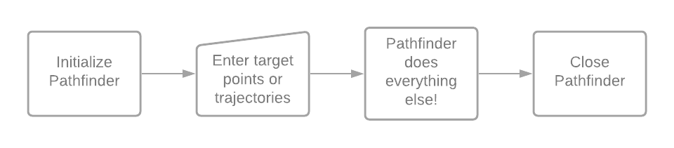

Odometry-dependent library for robotics-based competitions and challenges.
Click right [here](https://wobblyyyy.github.io/docs/pathfinder/quickstart.html) 
to get to the online documentation!

- Fully virtualized Euclidian geometry, allowing for collision detection, prevention, and
  advanced robot navigation. Create circles, rectangles, or circular rectangles (...?)
  and make your robot avoid them.
- Out-of-box support for different drivetrains, including swerve drive, meccanum drive, 
  tank drive, and any other form of holonomic drivetrain. Unsupported drivetrains can
  be added manually and will work exactly as intended.
- Efficient and optimized path finding and generation. Pathfinding planes in which there
  are no obstacles make use of accelerated path planning, allowing for on-the-fly path
  generation and following. As in: tell your robot to follow a path during Tele-Op, and
  it will do exactly that - no delay, no lag - just driving.
- A variety of different path following systems, including two, three, and four PID
  controller based path following systems.
- Plan trajectories using splines. Save them locally, record robot movement, and play
  back robot paths and trajectories. Optimize your drivetrain as effectively as possible,
  allowing for the fastest path following of your life.
- Abstract and general codebase that can be used anywhere with a JVM. Officially supported
  environments include...
  - FIRST Robotics Competition (on roboRIO)
  - FIRST Tech Challenge (on Android phones / control hub)
- Officially endorsed by NASA! Not really. Please don't sue me, actually. But it's cool,
  right? Very cool.
  

Please see the online quickstart, available [here](https://wobblyyyy.github.io/docs/pathfinder/quickstart.html).

Pathfinder began development around the end of November, 2020. Pathfinder was/is designed to be a
full-featured solution to path planning and following for wheeled mobile robots.
- Provide a simple interface for interacting with paths, following paths, and doing whatever else
  you want to do with paths. Pathfinder has the intention of providing everything from path finding 
  (object avoidance, etc) to path following. The original intention of this library was to create
  a solution that would allow an end user to command the robot to go to a point with as little as
  a single line of code. Other similiar libraries already exist, such as ACME Robotic's road-runner
  library, but Pathfinder is (as of now) the only library that provides everything you need as
  soon as you install the library. 
- Allow for serialization and deserialization of paths - paths should be able to be stored as JSON
  files, meaning they can be loaded and saved during execution. This means you can create a path
  using another GUI tool (or a text editor), drop the JSON file into your robot's "deploy" section
  (or source files, or resources - whatever you'd like) and load the path from your robot's internal
  storage system and begin following said path.
- Allow users to track the position of their robot by using odometry. A variety of odometry systems
  should be provided - notably, tank drive, swerve drive, three wheel, and two wheel. Gyroscopes
  should be used whenever possible to increase positional accuracy.
- Allow users to follow a given path using a built-in path following system. Path followers should
  cover the following categories: linear, proportional, and hopefully trajectory.
- Allow users to load paths in absolute and relatives modes. An absolute path will command the robot
  to go to the exact postions you notated - if the path starts at (10, 10) and your robot is at
  (20, 20), your robot will drive to (10, 10) and then continue the path as intended. Relative paths,
  on the other hand, are loaded relative to the robot's current facing. A robot at (10, 10) told to
  go to (20, 20) wouldn't go to (20, 20) - it would go to (30, 30), as (10, 10) + (20, 20) = (30, 30).
- Provide kinematics for each major type of holonomic drivetrain. These kinematics should be usable
  both by Pathfinder internally and users externally - if you get a brand-new meccanum drive and want
  to set it up really quickly, you can easily do so by using these provided kinematics.
- Allow for advanced movement trajectories and splines with error-based following, allowing robots to
  follow a path at the robot's maximum movement speed.
- Allow any users to use any of their own code in place of provided code. At the very core of
  Pathfinder is customizability - just about every feature should be expandable, extensible, replacable,
  customizable, optimizable, etc. If you don't like the provided drivetrain classes, you can make your
  own. If you don't like the provided odometry classes, you can make your own. 
- Provide a graphical user interface that allows users to create and modify paths with ease. These
  paths should be able to be created by providing a set of waypoints. Trajectories should be able to 
  be generated by using simple and intuitive controls.
- Be really epic. Yes, I do mean really epic - like... REALLY epic. Cool guys don't look at explosions.
  Cool robotics libraries are named "Pathfinder."

Pathfinder is a rather expansive library designed for a wide variety of pathfinding situations.
As a result, it can be pretty challenging to document every single feature and option contained
in the library. It's a lot easier to provide guides on how to make use of specific features
in video form, as they take a lot less time to create and are generally easier to understand.
Please see [this link](https://wobblyyyy.github.io/docs/pathfinder/videos.html) to learn more.

If you notice an issue or bug with Pathfinder, please report it on the issue tracker and send me
an email. It's more important that you submit an issue report so the issue is documented
in a public fashion. Issues or bugs will be resolved as quickly as possible whenever possible. 

Pathfinder is a fairly large project, and, as such, we always welcome contributors. If you notice
any bugs with Pathfinder, or would like to add any functionality, feel free to submit a pull
request. You can always feel free to add new features that don't detract from Pathfinder's
functionality. Examples include:
- New drivetrains (add drivetrains that aren't already supported)
- New following systems (new way to follow paths)
- New path generation system alternatives (new generator classes)

Pathfinder uses Gradle as a build system. Because Pathfinder is a library, the only task
you'll really need to run is `jar` or `shadowJar`. `shadowJar` will produce a jar with all
of the required dependencies bundled inside. This jar is about 300kb and includes all of
the libraries Pathfinder needs to operate. `jar` produces a jar much closer to 100kb in size.
It doesn't include any of the libraries Pathfinder needs to function - you'll need to add them
manually.

- [OdometryCore](https://github.com/tmthecoder/OdometryCore)
  Used for three wheel positional tracking. This library is very lightweight, so including
  it even when it isn't used shouldn't harm anyone.
- [EDT](https://github.com/Wobblyyyy/edt)
  Optimized data types used internally by Pathfinder. EDT is user-usable, but you can still
  use more standard data types if you'd prefer.
- [intra_utils](https://github.com/Wobblyyyy/intra_utils)
  A variety of utilities used by Pathfinder internally - intra_utils is really just a collection
  of random code I've found I've needed in many projects.
- [Pathfinder-Java](https://github.com/JaciBrunning/Pathfinder)
  This is being deprecated very soon!
- [PathfindingCore](https://github.com/Wobblyyyy/PathfindingCore)
  Actual path finding code - given point A and B and obstacles {X, Y, Z}, find a path between
  A and B that doesn't intersect with obstacles {X, Y, Z}.
  

Pathfinder strives to be a well-documented project - every method, class,
field, interface, enum, etc - should all have documentation. Documentation, in
its current state, is available from either of these two places.
- JavaDoc [(here)](https://wobblyyyy.github.io/JavaDocs/Pathfinder/)
- Regular docs [(here)](https://wobblyyyy.github.io/docs/pathfinder/quickstart.html)
- Video docs [(here)](https://wobblyyyy.github.io/docs/pathfinder/videos.html)

If you notice any documentation issues, or are struggling to understand the
meaning of any documentation, please contact me (Colin) (wobblyyyy@gmail.com)
and I'll try to get any issues sorted out as quickly as possible.
